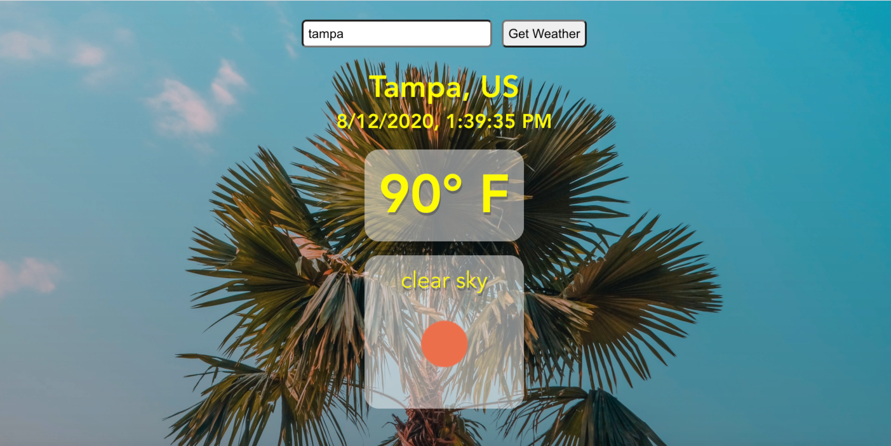

## Weather Vue



### Description
Weather Vue enables you find out the current weather in a city around the world.

### Project setup
```
yarn install
```
### Technologies Used
- [Vue](https://vuejs.org/) - JavaScript framework
- [Open Weather Map API](https://openweathermap.org/api)
- [Axios](https://www.npmjs.com/package/axios) - get data from api
  
### Improvements
- Set time to weather location, rather than local time.
- Display images based on time of day (day/night) and all weather types.
- Display random images from an array of images for each weather type.